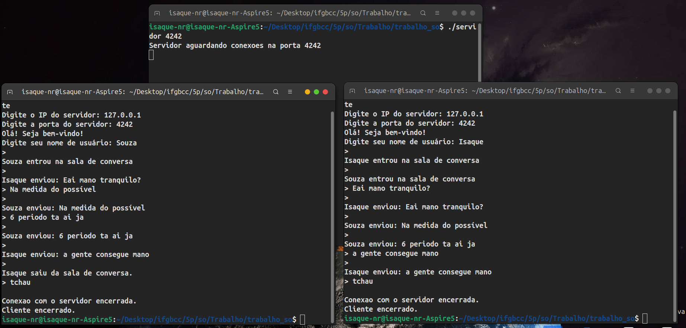

# Servidor de Chat Multiclientes
>Projeto acadêmico desenvolvido para a disciplina de **Sistemas Operacionais** do curso de **Ciência da Computação — IFG Campus Anápolis**.



O projeto consiste em um **sistema de chat multicliente em C++**, utilizando comunicação **TCP/IP**, múltiplas **threads** e o modelo **Produtor-Consumidor** para receber, armazenar e distribuir mensagens entre os usuários conectados.

O principal objetivo foi aplicar conceitos de **concorrência, sincronização e comunicação em rede** em uma aplicação prática.

---

## Conceitos aplicados

O projeto permitiu aplicar na prática:

* Threads e concorrência;
* Produtor-Consumidor;
* Exclusão mútua;
* Regiões críticas;
* Mutex;
* Semáforos;
* Sincronização entre threads;
* Filas FIFO;
* Comunicação Cliente-Servidor;
* Sockets;
* TCP/IP;
* Gerenciamento de conexões;
* Tratamento de pacotes de rede.
---
## Tecnologias e ferramentas

* **C++**
* **Sockets TCP/IP**
* **std::thread** — criação e gerenciamento de threads
* **std::mutex** — exclusão mútua e proteção de regiões críticas
* **std::counting_semaphore** — sincronização do buffer
* **G++ / GCC**
* **APIs POSIX de sockets** (socket, bind, listen, accept, connect, send, recv)

---

## Arquitetura

O sistema é dividido em um servidor e múltiplos clientes:

```text
                   SERVIDOR
                      │
               Thread Principal
                      │
          ┌───────────┼───────────┐
          |           |           |
      Produtora   Produtora   Produtora
      Cliente 1   Cliente 2   Cliente 3
          │           │           │
          └───────────┼───────────┘
                      |
              Buffer de Mensagens
                      │
              Thread Consumidora
                      │
          ┌───────────┼───────────┐
          |           |           |
       Cliente 1   Cliente 2   Cliente 3
```

A **thread principal** aceita novas conexões. Para cada cliente conectado é criada uma **thread produtora**, responsável por receber e processar suas mensagens.

Uma **thread consumidora** retira as mensagens do buffer e as envia para todos os clientes conectados.

---

## Threads

O servidor utiliza `std::thread`.

Para cada cliente conectado, uma nova thread é criada:

```cpp
std::thread tid_produtora(thread_produtora_cliente, clientfd);
tid_produtora.detach();
```

Assim, vários clientes podem ser atendidos simultaneamente sem bloquear a thread principal responsável por aceitar novas conexões.

O servidor também possui uma thread dedicada ao consumo das mensagens:

```cpp
std::thread tid_consumidora(thread_consumidora);
tid_consumidora.detach();
```

No cliente, uma thread separada recebe as mensagens do servidor enquanto a thread principal permanece disponível para entrada do usuário.

---

## Produtor-Consumidor

O principal conceito de Sistemas Operacionais aplicado no projeto é o padrão **Produtor-Consumidor**.

As threads que atendem os clientes funcionam como **produtoras**. Ao receber uma mensagem, elas a colocam na fila compartilhada:

```cpp
fila_mensagens.push(msg);
```

A thread consumidora retira as mensagens:

```cpp
msg = fila_mensagens.front();
fila_mensagens.pop();
```

e posteriormente envia a mensagem para todos os clientes conectados.

A fila utiliza a estrutura:

```cpp
std::queue<std::string> fila_mensagens;
```

seguindo o comportamento **FIFO (First In, First Out)**.

---

## Mutex e Semáforos

Como várias threads acessam a mesma fila, é necessário controlar o acesso ao recurso compartilhado.

### Mutex

O mutex protege a região crítica da fila:

```cpp
std::lock_guard<std::mutex> lock(mutex_buffer);
fila_mensagens.push(msg);
```

Dessa forma, apenas uma thread por vez modifica o buffer.

Outro mutex é utilizado para proteger a lista de clientes conectados.

### Semáforos

Foram utilizados dois `std::counting_semaphore`:

```cpp
std::counting_semaphore<MAX_BUFFER> sem_vazios(MAX_BUFFER);
std::counting_semaphore<MAX_BUFFER> sem_msgDisponiveis(0);
```

* `sem_vazios` controla os espaços disponíveis no buffer;
* `sem_msgDisponiveis` controla a quantidade de mensagens disponíveis para consumo.

A combinação de **mutex + semáforos** garante a sincronização entre as threads produtoras e a thread consumidora.

---

## Protocolo de Comunicação

As mensagens seguem o formato definido no trabalho:

```text
bom|comando|conteúdo|eom
```

### Entrada

```text
bom|usuario_entra|João|eom
```

### Mensagem

```text
bom|msg_cliente|Olá pessoal!|eom
```

### Saída

```text
bom|usuario_sai|João|eom
```

As mensagens enviadas pelo servidor utilizam:

```text
bom|msg_servidor|conteúdo|eom
```

---

## Tratamento dos pacotes TCP

Um cuidado importante da implementação foi considerar que o `recv()` **não garante que cada chamada corresponda exatamente a uma mensagem completa**.

Por isso, os dados recebidos são acumulados:

```cpp
acumulado.append(buffer, message_len);
```

e os pacotes são extraídos utilizando o marcador:

```text
|eom
```

Isso permite tratar situações em que várias mensagens chegam juntas ou uma mensagem chega dividida entre diferentes chamadas de `recv()`.

---

## Funcionamento do Cliente

Ao iniciar, o cliente:

1. Solicita o IP e a porta do servidor;
2. Estabelece a conexão TCP;
3. Recebe a mensagem de boas-vindas;
4. Solicita o nome do usuário;
5. Informa ao servidor que o usuário entrou;
6. Cria uma thread para receber mensagens;
7. Permite o envio de mensagens pelo usuário;
8. Ao digitar `tchau`, informa ao servidor que está saindo e encerra a conexão.

A thread receptora permite que o cliente **receba mensagens enquanto o usuário continua digitando**.

---

## Como Executar 

* **1-** Abra um terminal dentro do caminho onde estão os programas "servidor.cpp" e "cliente.cpp". 

* **2-** Compile o servidor com : g++ -std=c++20 -pthread servidor.cpp -o servidor && ./servidor 4242 (Caso o programa ja esteja compilado apenas digite "./servidor 4242") 

* **3-** Agora o servidor está esperando conexões. Abra outro terminal na mesma pasta (Pra cada usuario abra um terminal pra ele) e compile o programa com g++ -std=c++20 -pthread cliente.cpp -o cliente && ./cliente ( Caso o programa já estiver compilado apenas digite ./cliente no terminal)

* **4-** Insira o IP do servidor: 127.0.0.1 e a porta do servidor 4242. Coloque seu nome e pronto já está conectado ao chat, pode enviar mensagens a vontade. 

* **5-** Pra cada novo usuário faça os passo a passo **3** e **4**.
